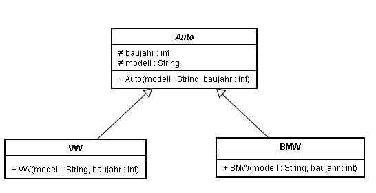

# Aufgabe 'Collections - Autos'

Lösen Sie bitte die Aufgabe in einem neuen Package.

## Achtung! Zuerst die Aufgabe nur mit den bekannten Collections lösen: ArrayList, LinkedList, HashSet, LinkedHashSet

- (1) Erstellen Sie eine abstrakte Klasse 'Auto' und die Klassen 'VW' und 'BMW' nach folgendem Klassendiagramm

- (2) Erstellen Sie eine Instanz vom Typ VW (Golf, Baujahr 1990) und eine Instanz vom Typ BMW (Z4, Baujahr 2000). Überschreiben Sie die toString-Methode für VW und BMW so, dass die Ausgaben mit `System.out.println` folgende Form haben:

        VW. Modell: Golf, Baujahr 1990
        BMW. Modell: Z4, Baujahr 2000

- (3) Erstellen Sie 3 Instanzen von VW. Weisen Sie dabei die Adressen der Objekte den Referenzen vw1, vw2 und vw3 zu.

- (4) Speichern Sie die 3 VW-Referenzen in LinkedList, HashSet, TreeSet und PriorityQueue. Beim Sortieren sollen die Objekte erst nach dem Modell und dann nach dem Baujahr verglichen werden. Die ggf. notwendige(n) 
   hashCode-Methode(n) soll(en) korrekt (richtig, gültig) aber nicht unbedingt sinnvoll implementiert werden.

- (5) Geben Sie alle erstellten Collections mit den foreach-Schleifen aus.

- (6) Erstellen Sie 2 Objekte von Typ 'BWM' und referenzieren Sie sie mit bmw1 und bmw2. Speicher Sie die Referenzen in ArrayList, HashSet und TreeSet. Geben Sie die neu erstellten Collections aus.

- (7) Benutzen Sie die Methode 'contains', um in dem hashSet von BMW-Objekten nach bmw1 zu suchen.

- (8) Fügen Sie der Klasse BMW die Setter-Methode für das Attribut 'baujahr' zu. Benutzen Sie die neue Methode mit der Referenz bmw1 um das Baujahr zu ändern. Versuchen Sie erneut mit der Methode 'contains' in dem HashSet von BMWs nach bmw1 zu suchen. Was liefert die Methode 'contains' und warum?

- (9) Erstellen Sie eine Instanz VW (Polo, Baujahr 2200) und speichern Sie ihre Adresse in der Liste mit VWs. Speichern Sie dabei die Adresse in keiner weiteren Referenz.

- (10) Benutzen Sie die Methode 'binarySearch' aus der Klasse 'Collections' und suchen Sie nach einem VW Polo, Baujahr 2200 in der Liste aus 9. Geben Sie das Ergebnis aus.

- (11) Benutzen Sie die Methode 'sort' aus der Klasse 'Collections' um die Liste mit VWs zu sortieren. Geben Sie die sortierte Liste aus.

- (12) Benutzen Sie die Methode 'sort' aus der Klasse 'Collections' um die Liste mit VWs in der Umkehrreihenfolge zu sortieren. Geben Sie die Liste aus.

- (13) Benutzen Sie die Methode 'binarySearch' aus der Klasse 'Collections' und suchen Sie nach einem VW Polo, Baujahr 2200 in der  Liste mit VWs. Geben Sie das Ergebnis aus.

- (14) Benutzen Sie die Methode 'binarySearch' aus der Klasse 'Collections' und suchen Sie nach einem VW Polo, Baujahr 3300 in der Liste mit VWs. Geben Sie das Ergebnis aus.
